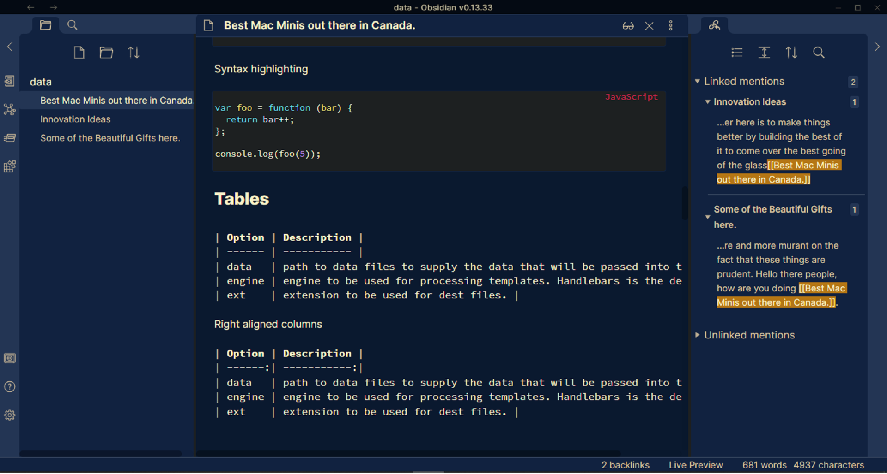

# Aqua-obsidian

A theme for Obsidian based on Atom's One Dark and One Light themes.

## Installation

1. Download obsidian.css to your Obsidian vault folder.
2. In Obsidian, click Settings -> Plugins make sure `Custom CSS` is enabled
3. Pick either light or dark theme in Obsidian's appearance settings!

### Credits:
The text colors which are golden, are inspired from <code>obsidian-andygruv</code> repo.
https://github.com/GuangluWu/obsidian-andygruv